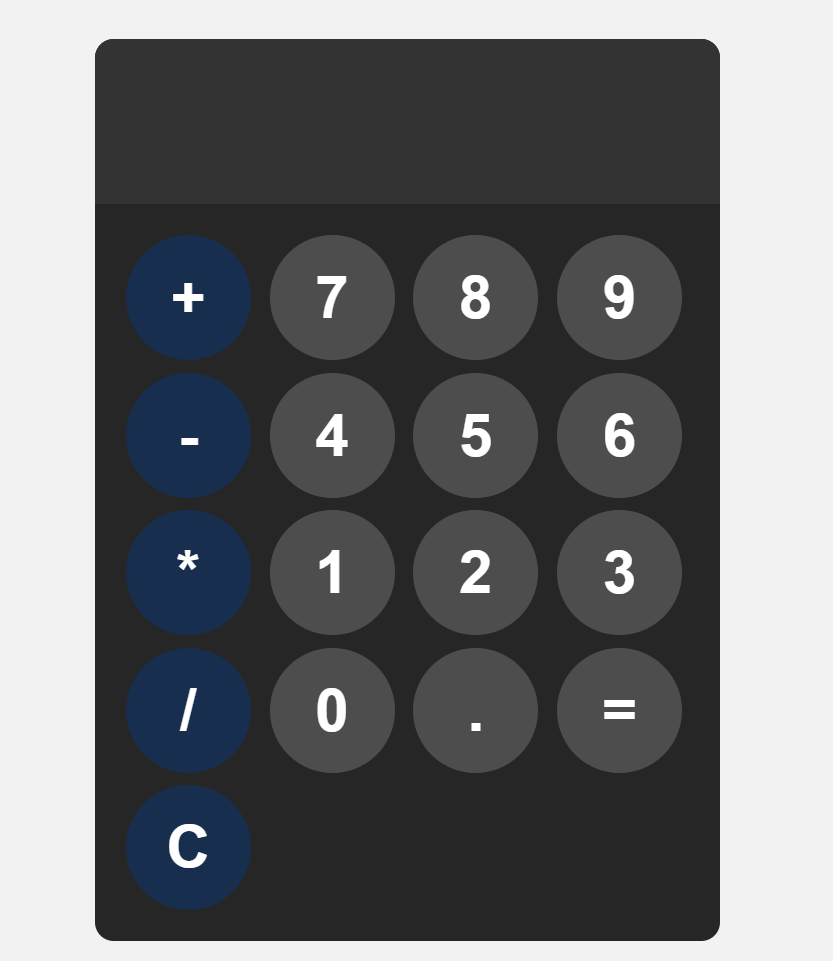

# Calculator

A sleek, minimal calculator built with HTML, CSS, and JS. Works with **buttons** and **keyboard input**. Just click, type, calculate, done. ⚡

## Features
- Basic arithmetic: `+`, `-`, `*`, `/`  
- Supports **keyboard input** and button clicks  
- Clear (`Esc`) and calculate (`Enter`)  

## Usage
1. Open `index.html` in your browser  
2. Click buttons or type numbers/operators  
3. Press `Enter` to calculate, `Esc` to clear  

## Screenshot

